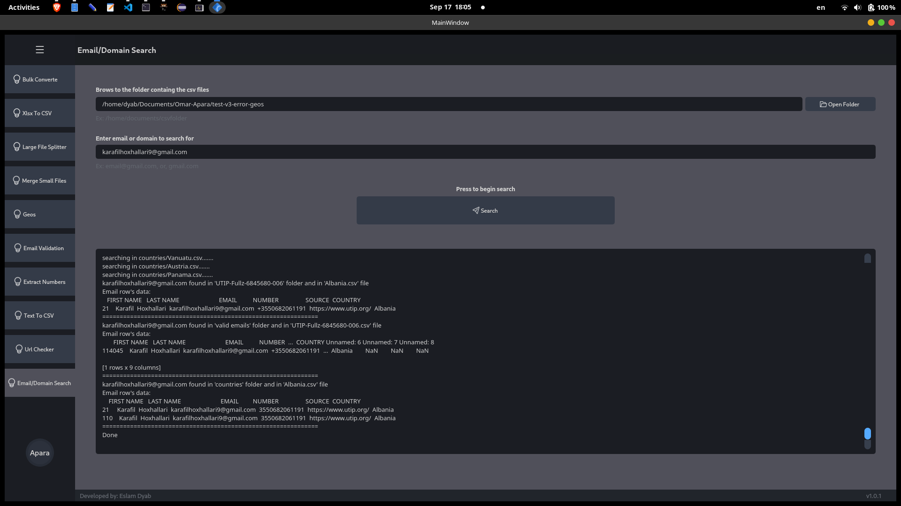

# Apara-Data-GUI
Custom application for Apara's data wrangling scripts

### Run
---
#### Optional:
Convert the ui to py: `pyuic5 -x MainWindow.ui -o ui.py`

Convert the qrc to py: `pyrcc5 files.qrc -o files_rc.py`

#### Must:
Run logic.py to use the gui: `python3 logic.py`
